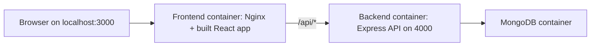

# Workplace Job Board

Workplace Job Board is a full-stack hiring platform built as a portfolio project to demonstrate product thinking, frontend polish, API design, authentication flow handling, and containerized delivery. It is not a single-page mockup: it includes separate job seeker and employer experiences, persistent MongoDB data, job posting workflows, search-driven discovery, and a commercial-style employer workspace.

## Why This Project Stands Out

- **Two-sided product experience**: candidates can browse and search roles while employers get a dedicated console for jobs, requests, and pipeline activity.
- **Real full-stack architecture**: React/Vite frontend, Express API, MongoDB persistence, password hashing with bcrypt, and Google Identity token verification.
- **Portfolio-ready UI direction**: public pages use a clean job-board layout, while the employer workspace uses a denser SaaS console pattern with KPIs, tables, sidebar navigation, and clear operational actions.
- **Search and discovery flow**: the welcome page search sends users into the job listing page with query state, and the featured job section can shuffle roles for demo exploration.
- **Authentication depth**: email/password signup and login, forgot-password request handling, role-aware Google login, and protected-state UX patterns are represented.
- **Dockerized delivery**: the complete app can run with one Docker Compose stack: frontend, backend, and MongoDB.

## Tech Stack

- **Frontend**: React 19, Vite 7, Tailwind CSS 4, React Router, React Icons
- **Backend**: Node.js, Express 5, TypeScript build step, MongoDB driver
- **Database**: MongoDB 7
- **Auth**: bcrypt password hashing, Google Identity Services ID token verification
- **Deployment workflow**: Docker Compose with an Nginx frontend reverse proxy

## Product Surfaces

- **Candidate home page** with job search, featured roles, and discovery actions
- **Job listing page** with query-based filtering
- **Authentication pages** for login, signup, Google login, and forgot password
- **About page** explaining the product in a polished portfolio style
- **Employer dashboard** with overview metrics, job management, request pipeline, and logout
- **Backend API** for users, jobs, Google login, forgot-password requests, and employer job posting

## Architecture



The frontend uses `/api` for all backend calls. In development, Vite proxies `/api` to `localhost:4000`. In Docker, Nginx serves the production React build and proxies `/api` to the backend service.

## Docker Quick Start

Requirements:

- Docker Desktop or Docker Engine with Docker Compose
- Node.js only if you want to use the npm shortcuts instead of raw Docker Compose commands

1. Copy the Docker environment template:

```bash
cp .env.docker.example .env
```

2. Optional: enable Google login by adding the same Google OAuth web client ID to both values in `.env`:

```env
GOOGLE_CLIENT_ID=your-google-oauth-web-client-id.apps.googleusercontent.com
VITE_GOOGLE_CLIENT_ID=your-google-oauth-web-client-id.apps.googleusercontent.com
```

If local ports are already in use, change these optional values in `.env`:

```env
FRONTEND_PORT=3001
BACKEND_PORT=4001
MONGO_PORT=27018
```

3. Build and start the full stack:

```bash
npm run docker:up
```

Or use Docker Compose directly:

```bash
docker compose up --build
```

4. Open the app:

- Frontend: http://localhost:3000
- Backend API: http://localhost:4000
- MongoDB: mongodb://localhost:27017

Use your custom port values instead if you changed them in `.env`.

5. Stop the stack:

```bash
npm run docker:down
```

## Docker Commands

```bash
npm run docker:build        # Build frontend and backend images
npm run docker:up           # Build and run all services in the foreground
npm run docker:up:detached  # Build and run all services in the background
npm run docker:logs         # Follow service logs
npm run docker:down         # Stop and remove the Compose services
```

## Local Development

Run MongoDB with Docker:

```bash
docker compose up -d mongo
```

Start the backend:

```bash
cd backend
cp .env.example .env
npm install
npm run dev
```

Start the frontend:

```bash
cd frontend
cp .env.example .env
npm install
npm run dev
```

Local URLs:

- Frontend dev server: http://localhost:3000
- Backend API: http://localhost:4000

## Environment Variables

Backend:

```env
PORT=4000
DB_URL=mongodb://127.0.0.1:27017
GOOGLE_CLIENT_ID=
```

Frontend:

```env
VITE_GOOGLE_CLIENT_ID=
```

Google login requires a real OAuth web client ID in both the frontend and backend environments. When the values are empty, the app keeps the standard email/password flow available.

## API Overview

- `GET /job-fetch` fetches jobs from MongoDB
- `POST /post-job` creates a job listing
- `DELETE /jobs/:id` deletes a job listing
- `POST /signing` creates a user
- `POST /login` authenticates email/password users
- `POST /auth/google` verifies a Google ID token and creates or returns a role-aware user
- `POST /forgot-password` validates a reset request and returns a safe response

## Portfolio Notes

This project is designed to show more than isolated coding ability. It demonstrates how a developer can shape a product from user-facing flows through infrastructure:

- Clear separation between candidate and employer needs
- Practical UI system across marketing, search, auth, and dashboard screens
- Backend validation and persistence instead of static demo data only
- OAuth-ready authentication architecture
- Containerized runtime suitable for demos, reviews, and deployment preparation

The result is a compact but complete hiring product that can be explained in interviews as both a frontend design system exercise and a full-stack engineering project.
